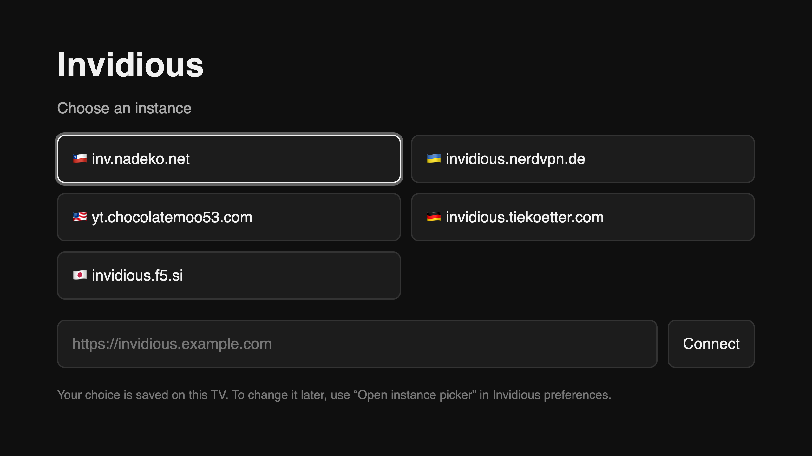

<div align="center">

# 📺 Invidious Tizen

**Use a Samsung TV remote on your Invidious instance — D-pad navigation, YouTube-TV-parity player controls, and a one-time instance picker.**

A [TizenBrew](https://github.com/reisxd/TizenBrew) module for **Tizen 5.5+** (2020 TVs and later).

[Install](#-install) · [Controls](#-controls) · [Instance picker](#-the-instance-picker) · [How it works](#-how-it-works) · [Develop](#-develop) · [Testing](#-testing)


<br>



<sub>The instance picker — presets from the Invidious docs, or bring your own URL.</sub>

</div>

---

Tizen's browser only hands a web page six keys — D-pad, Enter and Back. Media keys need an app to register them, and the Invidious web UI was never built for a 10-foot screen. This module fixes both: TizenBrew registers the media keys, and a small injected userscript adds visible focus, geometric D-pad navigation, and player controls that mirror the real YouTube TV app.

## ✨ Features

- **🧭 Real D-pad navigation** — focus moves to the nearest element in the pressed direction (not DOM order), with a visible focus ring and auto-scroll.
- **▶️ YouTube-TV player controls** — play/pause, `±10s` seek, and `0–9` to jump to a percentage, exactly like the TV app.
- **🎛 Media keys** — Play/Pause/Stop/Rewind/Fast-forward are registered via `tizen.tvinputdevice` and drive the video.js player.
- **🔀 Instance picker** — first launch asks where to connect; later launches probe the instance and redirect as soon as it answers.
- **🛟 Never stuck** — a dead instance leaves you on the picker instead of an error page, and Back steps back through history toward TizenBrew.
- **↩️ Back done right** — leave fullscreen → step back toward TizenBrew's module list → exit only at the very start.

## 🚀 Install

1. Install **TizenBrew** on the TV with the [TizenBrew Installer](https://github.com/reisxd/TizenBrewInstaller/releases) (enable Developer Mode, set the Host PC IP, reboot — see the [guide](https://github.com/reisxd/TizenBrew/blob/main/docs/README.md)).
2. In TizenBrew → **Add module** → type **GitHub** → name `lennartschoch/invidious-tizen` (pin a version with `…@v0.1.1`).
3. **Launch "Invidious TV"** and pick an instance.

> The repo must be public: TizenBrew fetches the module and userscript from jsDelivr, and the picker from GitHub Pages — same layout as [TizenPortal](https://github.com/axelnanol/tizenportal) (`websiteURL` → `…/dist/index.html`).

## 🎮 Controls

Mirrors YouTube TV wherever the buttons exist there.

| Remote key | Action |
|---|---|
| **D-pad** | Move focus between links/buttons/inputs |
| **OK** | Activate the focused item; in the player, reveal the controls |
| **Back** | Leave fullscreen → step back toward TizenBrew → exit at the start |
| **Play/Pause**, Play, Pause | Play or pause |
| **Stop** | Pause |
| **Rewind / Fast-forward** | Seek −10s / +10s |
| **0–9** | In the player: jump to 0–90% of the video |
| **Space** | Play or pause (keyboards/emulators) |
| Red / Green / Yellow / Blue | Nothing — YouTube TV ignores them, and so do we |

**Player mode.** Arrows steer the player only when it is fullscreen or focused:
`←/→` seek, `↑/↓` reveal the controls (volume stays on the TV's own keys, as on
YouTube TV). On a watch page with nothing focused, the D-pad navigates as usual,
so the sidebar and comments stay reachable — press **OK** to hand control to the
player.

## 🧭 The Instance Picker

TizenBrew loads a module's `websiteURL` and keeps injecting the userscript into
every page the webview visits, so `websiteURL` points at a small picker rather
than at one hardcoded instance.

- **First launch** waits for you to choose — a preset from the
  [Invidious docs](https://docs.invidious.io/instances/) or your own URL. The
  choice is saved on the TV.
- **Later launches** show a `Checking <host>…` state, probe the instance, and
  redirect **as soon as it answers**.
- **If it doesn't answer**, the picker stays put ("Couldn't reach …") — you're
  never dumped onto an error page.
- **Change it any time** from Invidious → **Preferences → Invidious Tizen → Open instance picker**.
- It uses `location.href` (assign), so it stays in history and **Back** steps through the picker on the way to TizenBrew.

## 🛠 How it works

```
TizenBrew ──launch──▶ dist/index.html            (picker — GitHub Pages)
                          │  choose / probe
                          ▼
                    Invidious instance  ◀── dist/userScript.js  (injected)
```

TizenBrew reads `package.json`, registers each entry in `keys` with
`tizen.tvinputdevice.registerKey`, opens `websiteURL`, and evaluates `main` in
every new execution context — which is why the userscript survives the
picker → instance hop. The userscript then:

- injects the focus ring + hint styles, and keeps the focused element on screen;
- implements geometric D-pad navigation over `a[href], button, input, …`;
- drives the video.js player (or a raw `<video>`) for playback, seek and percentage jumps;
- adds an **Invidious Tizen** section to `/preferences` with an *Open instance picker* button.

## 💻 Develop

Modern, fast toolchain — **TypeScript 7** (native `tsc`), **esbuild** for the
bundle, **oxlint** (Rust) for lint and **oxfmt** (Rust) for format.

| | Tool |
|---|---|
| Type-check | `typescript@7` native `tsc` (`npm run check`, ~0.3s) |
| Bundle | `esbuild --bundle --format=iife --target=chrome69` |
| Lint | `oxlint` |
| Format | `oxfmt` |

```bash
npm install
npm run build      # check + format:check + lint + bundle -> dist/ (committed)
npm run check      # tsc --noEmit
npm run lint       # oxlint   (lint:fix to autofix)
npm run format     # oxfmt    (format:check to verify)
npm run watch      # esbuild rebuild on change
```

### Layout

```
src/
├── picker/index.html        # the instance picker (copied to dist/index.html)
├── globals.d.ts             # types for window.player (video.js) and tizen
└── userscript/
    ├── index.ts             # entry: guard + init
    ├── constants.ts         # key codes, PICKER_URL, version
    ├── keys.ts              # keydown → actions
    ├── media.ts             # player/<video> adapter + playback actions
    ├── navigation.ts        # geometric D-pad focus movement
    ├── preferences.ts       # the /preferences section
    ├── hint.ts, styles.ts, log.ts
```

`esbuild` targets `chrome69`, so newer syntax is down-levelled for Tizen 5.5.
`dist/userScript.js` and `dist/index.html` are build output but are **committed**
— jsDelivr and GitHub Pages serve them.

## 🧪 Testing

Unit tests drive the **built** userscript in jsdom (geometry stubbed via a
`data-box` attribute) and the picker:

```bash
npm test
```

End-to-end runs against a **real instance in a genuine Chromium 69 with H.264**,
simulating remote buttons with trusted key events (Apple `container` CLI on macOS):

```bash
scripts/chrome69.sh up      # builds/runs the browser, prints the CDP URL
npm run test:e2e            # INVIDIOUS_URL / TEST_VIDEO override the defaults
scripts/chrome69.sh down
```

## ⚠️ Notes

- `inv.nadeko.net` runs a **"Go-away" CAPTCHA**, so it may challenge the webview before it works — pick another instance if it does.
- The userscript's key registration path (`tizen.tvinputdevice`) is the one piece that can only be fully exercised on the TV.
- To target a single instance instead of the picker, set `websiteURL` to it (and update `PICKER_URL` if you fork the picker).

## 📄 License

[MIT](LICENSE). Not affiliated with Invidious, YouTube, or Samsung. Controls
mirror the YouTube TV app; module patterns follow [TizenBrew](https://github.com/reisxd/TizenBrew),
[TizenTube](https://github.com/reisxd/TizenTube) and [TizenPortal](https://github.com/axelnanol/tizenportal).
